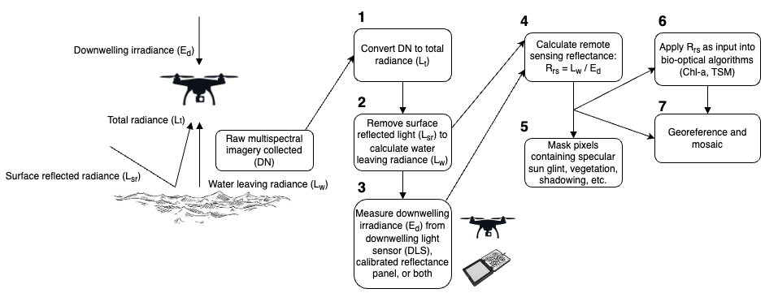
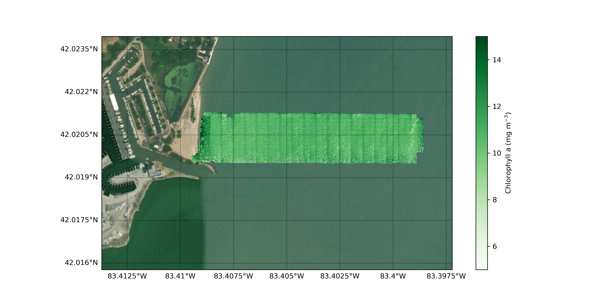

[](https://doi.org/10.5281/zenodo.14018788)

# DroneWQ: A Python library for measuring water quality with a multispectral drone sensor


DroneWQ is a Python package that can be used to analyze multispectral data collected from a drone to derive ocean color radiometry and water quality properties. These scripts are specific for the MicaSense RedEdge and Altum cameras. 




For details on the processing and theory of DroneWQ, please visit our readthedocs: https://dronewq.readthedocs.io/

Additional information on the methods can be found in:

Román, A., Heredia, S., Windle, A. E., Tovar-Sánchez, A., & Navarro, G., 2024. Enhancing Georeferencing and Mosaicking Techniques over Water Surfaces with High-Resolution Unmanned Aerial Vehicle (UAV) Imagery. Remote Sensing, 16(2), 290. https://doi.org/10.3390/rs16020290

Gray, P.C., Windle, A.E., Dale, J., Savelyev, I.B., Johnson, Z.I., Silsbe, G.M., Larsen, G.D. and Johnston, D.W., 2022. Robust ocean color from drones: Viewing geometry, sky reflection removal, uncertainty analysis, and a survey of the Gulf Stream front. Limnology and Oceanography: Methods. https://doi.org/10.1002/lom3.10511

Windle, A.E. and Silsbe, G.M., 2021. Evaluation of unoccupied aircraft system (UAS) remote sensing reflectance retrievals for water quality monitoring in coastal waters. Frontiers in Environmental Science, p.182. https://doi.org/10.3389/fenvs.2021.674247


## Installation

### Install from PyPI (Recommended)

The easiest way to install DroneWQ is using pip:

```bash
pip install dronewq
```

### Install from Source

If you want to install from source:

```bash
git clone https://github.com/aewindle110/DroneWQ.git
cd DroneWQ
pip install -e .
```

### System Requirements

DroneWQ requires Python 3.8-3.12. Some dependencies may require additional system libraries:

- **GDAL**: Required for geospatial operations
- **ExifTool**: Required for reading MicaSense image metadata
- **ZBar**: Required for QR code reading from calibration panels


On Ubuntu/Debian:
```bash
sudo apt-get update
sudo apt-get install gdal-bin libgdal-dev exiftool zbar-tools python3-gdal python3-cartopy
```


On macOS (using Homebrew):
```bash
brew install gdal exiftool zbar
```

### Docker Installation (Alternative)

We recommend running this package in a Docker container for consistency. The Docker image includes all dependencies pre-configured. See https://docs.docker.com/ for installation files.

With Docker installed and running, launch the container:

```bash
docker run -it -v <local directory>:/home/jovyan --rm -p 8888:8888 clifgray/dronewq:v3
```

where `<local directory>` is where you want data to be saved. 

Then launch Jupyter Lab:

```bash
jupyter lab --allow-root --ip 0.0.0.0 /home/jovyan
```

Copy the generated URL from the terminal into your web browser.

### Conda Installation

Alternatively, you can create a conda environment:

```bash
conda env create -f environment.yml
conda activate dronewq
```

**Note**: We have included a modified version of the MicaSense imageprocessing scripts in this repo. Our modifications include:
- Radiance data type expressed as Float32 instead of Uint16
- Image radiance output in milliwatts (mW) instead of watts (W)
- Modified `capture.save_capture_as_stack()` to not scale and filter data

These modifications impact the panel_ed calculation. When MicaSense releases a package with user-specified radiance data types, we will revert to their official package. 


## Quick Start

### 1. Organize Your Data

DroneWQ requires MicaSense images organized in a specific folder structure:

```
<main_directory>/
    ├── panel/              # Calibrated reflectance panel images (before/after flight)
    ├── raw_sky_imgs/       # Sky images (40° from zenith, ~135° azimuth)
    ├── raw_water_imgs/     # Water images from flight
    └── align_img/          # One image capture (5 .tif files) for alignment
```

**Directory descriptions:**
- **panel/**: Contains image captures of the MicaSense calibrated reflectance panel
- **raw_sky_imgs/**: Contains sky images taken at 40° from zenith and ~135° azimuthal viewing direction
- **raw_water_imgs/**: Contains all water images captured during the flight
- **align_img/**: Contains one image capture (5 .tif files, one per band) from `raw_water_imgs/` used to compute the warp matrix for aligning all images

You can find a sample dataset (Lake Erie) at [Zenodo DOI](https://doi.org/10.5281/zenodo.14018788).

### 2. Configure Settings

Before processing, configure the main directory path:

```python
import dronewq

# Configure the main directory containing your organized images
dronewq.configure(main_dir="/path/to/your/main_directory")
```

The `configure()` function automatically sets up all subdirectory paths based on the main directory.

### 3. Process Raw Imagery to Remote Sensing Reflectance

The main processing function converts raw imagery to calibrated remote sensing reflectance:

```python
# Process raw images to Rrs
dronewq.process_raw_to_rrs(
    output_csv_path="/path/to/metadata.csv",
    lw_method="mobley_rho_method",      # Water leaving radiance method
    ed_method="dls_ed",                 # Downwelling irradiance method
    mask_pixels=True,                   # Apply pixel masking
    pixel_masking_method="value_threshold",
    nir_threshold=0.01,                 # NIR threshold for masking glint
    green_threshold=0.005,              # Green threshold for masking shadows
    num_workers=4                       # Number of parallel workers
)
```

**Processing workflow:**
1. **Raw → Lt**: Converts raw pixel values to radiance (Lt)
2. **Lt → Lw**: Removes sky reflection to get water-leaving radiance (Lw)
3. **Lw → Rrs**: Normalizes by downwelling irradiance (Ed) to get remote sensing reflectance (Rrs)
4. **Masking**: Optionally masks pixels containing glint, shadows, or vegetation

### 4. Calculate Water Quality Parameters

Apply bio-optical algorithms to retrieve water quality parameters:

```python
# Calculate chlorophyll-a using Gitelson algorithm
dronewq.save_wq_imgs(
    wq_alg="chl_gitelson",  # Options: chl_gitelson, chl_hu, chl_ocx, chl_hu_ocx, nechad_tsm
    num_workers=4
)
```

### 5. Georeference and Mosaic

Georeference individual images and create an orthomosaic:

```python
# Load metadata
import pandas as pd
metadata = pd.read_csv("/path/to/metadata.csv")

# Compute flight lines
flight_lines = dronewq.compute_flight_lines(
    captures_yaw=metadata['Yaw'].values,
    altitude=metadata['Altitude'].values[0],
    pitch=0,
    roll=0
)

# Georeference images
dronewq.georeference(
    metadata=metadata,
    input_dir=dronewq.settings.rrs_dir,
    output_dir="/path/to/georeferenced/",
    lines=flight_lines
)

# Create mosaic
dronewq.mosaic(
    input_dir="/path/to/georeferenced/",
    output_path="/path/to/mosaic.tif"
)
```

## Detailed Documentation 


For detailed documentation on the processing theory and methods, please visit: https://dronewq.readthedocs.io/

## API Reference

### Core Processing Functions

#### `process_raw_to_rrs()`

Main function to process raw imagery to remote sensing reflectance (Rrs).

```python
dronewq.process_raw_to_rrs(
    output_csv_path: str,
    lw_method: str = "mobley_rho_method",
    mask_pixels: bool = False,
    random_n: int = 10,
    pixel_masking_method: str = "value_threshold",
    mask_std_factor: int = 1,
    nir_threshold: float = 0.01,
    green_threshold: float = 0.005,
    ed_method: str = "dls_ed",
    overwrite_lt_lw: bool = False,
    clean_intermediates: bool = True,
    num_workers: int = 4
)
```

**Parameters:**
- `output_csv_path` (str): Path to write the metadata CSV file
- `lw_method` (str): Method for calculating water-leaving radiance. Options:
  - `"mobley_rho_method"` (default): Uses Mobley's rho parameter
  - `"hedley_method"`: Hedley/Hochberg sky glint removal
  - `"blackpixel_method"`: Black pixel assumption method
- `ed_method` (str): Method for calculating downwelling irradiance. Options:
  - `"dls_ed"` (default): Uses DLS sensor data
  - `"panel_ed"`: Uses calibrated reflectance panel
  - `"dls_and_panel_ed"`: DLS corrected by panel
- `mask_pixels` (bool): Whether to apply pixel masking (default: False)
- `pixel_masking_method` (str): Masking method - `"value_threshold"` or `"std_threshold"`
- `nir_threshold` (float): NIR reflectance threshold for masking glint (default: 0.01)
- `green_threshold` (float): Green reflectance threshold for masking shadows (default: 0.005)
- `num_workers` (int): Number of parallel workers (default: 4)

#### `save_wq_imgs()`

Calculate water quality parameters from Rrs images.

```python
dronewq.save_wq_imgs(
    wq_alg: str = "chl_gitelson",
    start: int = 0,
    count: int = 10000,
    num_workers: int = 4
)
```

**Parameters:**
- `wq_alg` (str): Water quality algorithm to apply. Options:
  - `"chl_gitelson"` (default): Gitelson et al. 2007, recommended for coastal waters
  - `"chl_hu"`: Hu et al. 2012, for low chlorophyll (<0.15 mg m⁻³)
  - `"chl_ocx"`: OCx algorithm, for higher chlorophyll (>0.2 mg m⁻³)
  - `"chl_hu_ocx"`: Blended NASA algorithm combining Hu and OCx
  - `"nechad_tsm"`: Nechad et al. 2010 for total suspended matter
- `start` (int): Starting image index (default: 0)
- `count` (int): Number of images to process (default: 10000)
- `num_workers` (int): Number of parallel workers (default: 4)

### Water Quality Algorithms

#### Chlorophyll-a Algorithms

```python
# Gitelson (recommended for coastal/Case 2 waters)
chl = dronewq.chl_gitelson(Rrsred, Rrsrededge)

# Hu (for low chlorophyll concentrations)
chl = dronewq.chl_hu(Rrsblue, Rrsgreen, Rrsred)

# OCx (for higher chlorophyll concentrations)
chl = dronewq.chl_ocx(Rrsblue, Rrsgreen)

# Blended Hu-OCx (NASA standard)
chl = dronewq.chl_hu_ocx(Rrsblue, Rrsgreen, Rrsred)
```

#### Total Suspended Matter

```python
# Nechad et al. 2010
tsm = dronewq.tsm_nechad(Rrsred)
```

### Georeferencing and Mosaicking

#### `compute_flight_lines()`

Compute flight lines from capture metadata.

```python
flight_lines = dronewq.compute_flight_lines(
    captures_yaw: np.ndarray,
    altitude: float,
    pitch: float = 0,
    roll: float = 0,
    threshold: float = 10
)
```

#### `georeference()`

Georeference images using camera metadata and flight parameters.

```python
dronewq.georeference(
    metadata: pd.DataFrame,
    input_dir: str,
    output_dir: str,
    lines: List[Dict] = None,
    altitude: float = None,
    pitch: float = 0,
    roll: float = 0,
    yaw: float = None,
    num_workers: int = 4
)
```

#### `mosaic()`

Create an orthomosaic from georeferenced images.

```python
dronewq.mosaic(
    input_dir: str,
    output_path: str,
    method: str = "mean"
)
```

### Utility Functions

#### `configure()`

Configure package settings (main directory and subdirectories).

```python
dronewq.configure(main_dir="/path/to/main_directory")
```

#### `retrieve_imgs_and_metadata()`

Load images and associated metadata.

```python
images, metadata = dronewq.retrieve_imgs_and_metadata(
    img_dir: str,
    count: int = 10000,
    start: int = 0,
    altitude_cutoff: float = 0,
    sky: bool = False,
    random: bool = False
)
```

#### `write_metadata_csv()`

Extract and save image metadata to CSV.

```python
dronewq.write_metadata_csv(
    img_set: ImageSet,
    csv_output_path: str
)
```

### Module Overview

**Core Modules (`dronewq.core`):**
- `raw_to_rss.py`: Main processing pipeline (raw → Rrs)
- `wq_calc.py`: Water quality algorithm implementations
- `georeference.py`: Image georeferencing functions
- `mosaic.py`: Orthomosaic creation
- `plot_map.py`: Visualization utilities

**Water Leaving Radiance Methods (`dronewq.lw_methods`):**
- `mobley_rho.py`: Mobley rho sky reflection removal
- `hedley.py`: Hedley/Hochberg method
- `blackpixel.py`: Black pixel assumption method

**Downwelling Irradiance Methods (`dronewq.ed_methods`):**
- `dls_ed.py`: DLS-based irradiance calculation
- `panel_ed.py`: Panel-based irradiance calculation

**Masking Methods (`dronewq.masks`):**
- `threshold_masking.py`: Threshold-based pixel masking
- `std_masking.py`: Standard deviation-based masking

**Utilities (`dronewq.utils`):**
- `settings.py`: Configuration management
- `images.py`: Image loading and processing utilities
- `metadata.py`: Metadata extraction and management

## Example Workflow

See the `primary_demo.ipynb` notebook for a complete example workflow using the Lake Erie dataset. The notebook demonstrates:

1. Setting up the workspace
2. Extracting and viewing metadata
3. Processing raw imagery to Rrs
4. Applying bio-optical algorithms
5. Georeferencing and creating mosaics

## Configuration

DroneWQ uses a singleton settings object to manage paths and configuration:

```python
import dronewq

# Set main directory (auto-populates subdirectories)
dronewq.configure(main_dir="/path/to/data")

# Access settings
print(dronewq.settings.main_dir)
print(dronewq.settings.rrs_dir)
print(dronewq.settings.wq_dir)

# Or use the settings object directly
from dronewq.utils.settings import settings
settings.configure(main_dir="/path/to/data")
```

## Performance Tips

1. **Parallel Processing**: Adjust `num_workers` based on your CPU cores (default: 4)
2. **Batch Processing**: Use `start` and `count` parameters to process large datasets in batches
3. **Intermediate Cleanup**: Set `clean_intermediates=True` to save disk space after processing
4. **Memory Management**: For very large datasets, process images in smaller batches


---



Example orthomosaic of UAS images collected over Western Lake Erie, processed to chlorophyll a concentration using DroneWQ.

