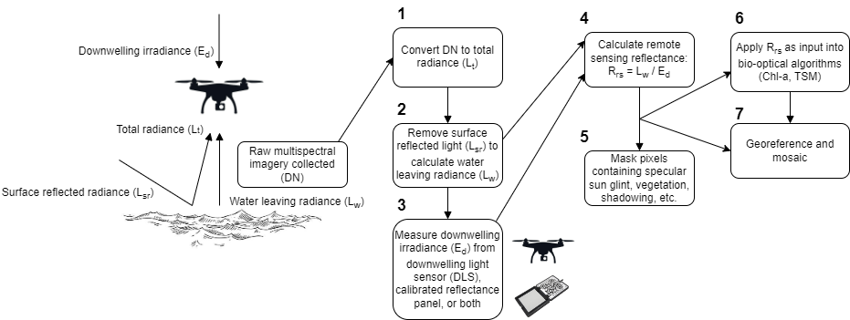

# DroneWQ: A Python library for measuring water quality with a multispectral drone sensor


DroneWQ is a Python package that can be used to analyze multispectral data collected from a drone to derive ocean color radiometry and water quality properties. These scripts are specific for the MicaSense RedEdge and Altum cameras. 

The main processing script has the ability to **1)** convert raw multispectral imagery to total radiance (L<sub>t</sub>) with units of W/m<sup>2</sup>/nm/sr, **2)** remove surface reflected light (L<sub>sr</sub>) to calculate water leaving radiance (L<sub>w</sub>), **3)** measure downwelling irradiance (E<sub>d</sub>) from either the calibrated reflectance panel, downwelling light sensor (DLS), or a combination of the two, **4)** calculate remote sensing reflectance (R<sub>rs</sub>) by dividing E<sub>d</sub> by L<sub>w</sub>, and **5)** mask pixels containing specular sun glint or instances of vegetation, shadowing, etc., **6)** use R<sub>rs</sub> as input into various bio-optical algorithms to derive chlorophyll a and total suspended sediment concentrations, and **7)** georeference using image metadata to orient and map to a known coordinate system. 



More information on the methods applied in this package can be found in:

Gray, P.C., Windle, A.E., Dale, J., Savelyev, I.B., Johnson, Z.I., Silsbe, G.M., Larsen, G.D. and Johnston, D.W., 2022. Robust ocean color from drones: Viewing geometry, sky reflection removal, uncertainty analysis, and a survey of the Gulf Stream front. Limnology and Oceanography: Methods. https://doi.org/10.1002/lom3.10511

Windle, A.E. and Silsbe, G.M., 2021. Evaluation of unoccupied aircraft system (UAS) remote sensing reflectance retrievals for water quality monitoring in coastal waters. Frontiers in Environmental Science, p.182. https://doi.org/10.3389/fenvs.2021.674247


## Installation

### Requirements

We recommend running this package in a Docker container, which is the environment that it was developed and tested in. See https://docs.docker.com/ for installation files. You will also need to install git (https://github.com/git-guides/install-git). Total file size is ~ 1.6 GB.

### Initial Setup

Once Docker and git are installed, setup a local directory. We recommend that the directory does not contain any spaces (e.g. C:\micasense but not C:\Users\foo bar\micasense). Navigate to the directory through terminal (OSX or Linux) or Powershell (Windows). Clone the repo to your local machine: 

`git clone https://github.com/aewindle110/DroneWQ.git`.  

## Launching code
    
With the Docker app running on your desktop, you need to launch the Docker container. Note that the first execution of this line of code will install the Docker image  and setup and configure all required software (python, jupyter notebooks) and packages. 
    
`docker run -it -v <local directory>:/home/jovyan --rm -p 8888:8888 clifgray/dronewq:v2`

 Activate the micasense environment and launch a jupyter notebook: 

`conda activate micasense`

`jupyter notebook --allow-root --ip 0.0.0.0 /home/jovyan`

Copy the generated URL in the terminal (e.g. `http://127.0.0.1:8888/?token=<auto generated token>`) into a web browser.

## Alternative Installation (conda) 

You can also build the environment yourself by following the instructions from the micasense repo here https://micasense.github.io/imageprocessing/MicaSense%20Image%20Processing%20Setup.html. We have included a lightweight version of the MicaSense imageprocessing scripts in this repo (original scripts can be found [here](https://github.com/micasense/imageprocessing). Note that our imageprocessing scripts are slightly modified in that radiance data type is expressed as Float32 instead of Uint16. Micasense is planning on a future package with user specified radiance data types, at which point we will revert to their package version.

`cd` to the direcotry you cloned this repository to

`conda env create -f environment.yml`

This will configure an anaconda environment with all of the required tools and libraries. 
When it's done, run `conda activate dronewq` to activate the environment configured.
Each time you run start a new anaconda prompt, you'll need to run `conda activate dronewq`.

To access jupyter notebook or lab, run `jupyter lab` or `jupyter notebook`


## ***MicaSense Folder Structure*** 
Once all MicaSense images have been downloaded into a local directory (e.g. `\data`), separate images into 4 sub-directories as below:
```
\data
    \panel
    \raw_sky_imgs
    \raw_water_imgs
    \align_img
```
* The panel directory should contain all image captures of the Micasense calibrated reflectance panel taken either before or after the flight 
* The raw_sky_imgs directory should contain all image captures taken of the sky at a 40 deg angle from zenith and an apprximate 135 deg azimuthal viewing direction
* The raw_water_imgs directory should contain all image captures of water taken during flight 
* The align_img directory should contain one image capture (5 .tifs) from the raw_water_imgs directory. The warp_matrix derived from this image capture is used to align all image captures in raw_water_imgs. 

## 

## Please see paper.md for detailed information on image processing.
