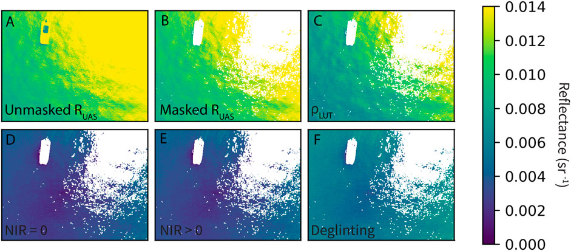

[](https://doi.org/10.5281/zenodo.14018788)

# DroneWQ: A Python library for measuring water quality with a multispectral drone sensor


DroneWQ is a Python package that can be used to analyze multispectral data collected from a drone to derive ocean color radiometry and water quality properties. These scripts are specific for the MicaSense RedEdge and Altum cameras. 


More information on the methods applied in this package can be found in:

Román, A., Heredia, S., Windle, A. E., Tovar-Sánchez, A., & Navarro, G., 2024. Enhancing Georeferencing and Mosaicking Techniques over Water Surfaces with High-Resolution Unmanned Aerial Vehicle (UAV) Imagery. Remote Sensing, 16(2), 290. https://doi.org/10.3390/rs16020290

Gray, P.C., Windle, A.E., Dale, J., Savelyev, I.B., Johnson, Z.I., Silsbe, G.M., Larsen, G.D. and Johnston, D.W., 2022. Robust ocean color from drones: Viewing geometry, sky reflection removal, uncertainty analysis, and a survey of the Gulf Stream front. Limnology and Oceanography: Methods. https://doi.org/10.1002/lom3.10511

Windle, A.E. and Silsbe, G.M., 2021. Evaluation of unoccupied aircraft system (UAS) remote sensing reflectance retrievals for water quality monitoring in coastal waters. Frontiers in Environmental Science, p.182. https://doi.org/10.3389/fenvs.2021.674247


## Installation

### Requirements

We recommend running this package in a Docker container, which is the environment that it was developed and tested in. See https://docs.docker.com/ for installation files. You will also need to install git (https://github.com/git-guides/install-git). Total file size is ~ 1.6 GB.

### Initial Setup

Once Docker and git are installed, setup a local directory. Navigate to the directory through terminal (OSX or Linux) or Powershell (Windows). Clone the repo to your local machine: 

`git clone https://github.com/aewindle110/DroneWQ.git`.  

## Launching code
    
With the Docker app running on your desktop, you need to launch the Docker container. Note that the first execution of this line of code will install the Docker image and setup and configure all required software (python, jupyter notebooks) and packages. This could take several minutes, depending on computer speed.
    
`docker run -it -v <local directory>:/home/jovyan --rm -p 8888:8888 clifgray/dronewq:v3`

where `<local directory>` is where you want data to be saved. 

It should already be activated but if you need to activate the dronewq conda environment: 

`conda activate dronewq`

And then launch a jupyter lab or notebook from the home directory on the docker container:

`jupyter lab --allow-root --ip 0.0.0.0 /home/jovyan`

Copy the generated URL in the terminal (e.g. `http://127.0.0.1:8888/?token=<auto generated token>`) into a web browser.

## Alternative Installation (conda) 

You can also build the environment yourself by following the instructions from the micasense repo here https://micasense.github.io/imageprocessing/MicaSense%20Image%20Processing%20Setup.html which includes instructions on how to download exiftool. We have included a lightweight version of the MicaSense imageprocessing scripts in this repo (they can be found [here](https://github.com/micasense/imageprocessing). Note that our `micasense` scripts are slightly modified in that radiance data type is expressed as Float32 instead of Uint16 and we change the output of image.radiance() to output milliwatts (mW) instead of watts (W). This impacts the panel_ed calculation which relies on image.radiance(). We also modified capture.save_capture_as_stack() accordingly to not scale and filter the data. MicaSense is planning on a future package with user specified radiance data types, at which point we will revert to their package version.

After you have cloned the DroneWQ repo to your local machine and installed exiftool, `cd` to the directory you cloned this repository to.

Create a virtual conda env by running `conda env create -f environment.yml`. This will configure an anaconda environment with all of the required tools and libraries. 
When it's done, run `conda activate dronewq` to activate the environment configured.
Each time you start a new anaconda prompt, you'll need to run `conda activate dronewq`.

To access jupyter notebook or lab, run `jupyter lab` or `jupyter notebook`


## ***MicaSense Folder Structure*** 
Once all MicaSense images have been downloaded into a local directory (e.g. `\data`), you will need to manually separate images into 4 sub-directories as below:
```
\data
    \panel
    \raw_sky_imgs
    \raw_water_imgs
    \align_img
```
* The panel directory should contain all image captures of the Micasense calibrated reflectance panel taken either before or after the flight 
* The raw_sky_imgs directory should contain all image captures taken of the sky at a 40 deg angle from zenith and an apprximate 135 deg azimuthal viewing direction
* The raw_water_imgs directory should contain all image captures of water taken during flight 
* The align_img directory should contain one image capture (5 .tifs) from the raw_water_imgs directory. The warp_matrix derived from this image capture is used to align all image captures in raw_water_imgs. 

You can find the Lake Erie sample dataset at [Zenodo DOI](https://doi.org/10.5281/zenodo.14018788). 

# Processing and theory 

## Removal of surface reflected light (L<sub>T</sub> - L<sub>SR</sub> = L<sub>W</sub>) 

The inclusion of L<sub>SR</sub> can lead to an overestimation of R<sub>rs</sub> and remotely sensed water quality retrievals, as shown in Figure 1. `DroneWQ` provides three common approaches to remove L<sub>SR</sub> as described below. See an intercomparison of these methods for UAS imagery in [@windle_silsbe_2021].


<br/>
Figure 1. Example of an individual UAS image (green band) with different radiometric values: (A) R<sub>UAS</sub>, (B) R<sub>UAS</sub> with initial sun glint masking and (C–F) remote sensing reflectance (R<sub>rs</sub>) using various methods to remove surface reflected light: (C) ⍴ look-up table (LUT) from HydroLight simulations, (D) Dark pixel assumption with NIR = 0, (E) Dark pixel assumption with NIR > 0, (F) Deglingting methods following [@hedley_harborne_mumby_2005]. Figure taken from [@windle_silsbe_2021].

In `DroneWQ`, we provide the following methods to calculate R<sub>rs</sub>:

`blackpixel_method()`
<br/>
One method to remove L<sub>SR</sub> relies on the so-called black pixel assumption that assumes L<sub>W</sub> in the near infrared (NIR) is negligible due to strong absorption of water. Where this assumption holds, at-sensor radiance measured in the NIR is solely L<sub>SR</sub> and allows ⍴ to be calculated if L<sub>sky</sub> is known. Studies have used this assumption to estimate and remove L<sub>SR</sub>; however, the assumption tends to fail in more turbid waters where high concentrations of particles enhance backscattering and L<sub>W</sub> in the NIR [@siegel_wang_maritorena_robinson_2000]. *Therefore, this method should only be used in waters whose optical propeties are dominated and co-vary with phytoplankton (e.g. Case 1, open ocean waters).* 

`mobley_rho_method()`
<br/>
Tabulated ρ values have been derived from numerical simulations with modelled sea surfaces, Cox and Munk wave states (wind), and viewing geometries [@mobley_1999]. Mobley (1999) provides the recommendation of collecting radiance measurements at viewing directions of θ = 40° from nadir and ɸ = 135° from the sun to minimize the effects of sun glint and nonuniform sky radiance with a ⍴ value of 0.028 for wind speeds less than 5 m/s. These suggested viewing geometries and ⍴ value have been used to estimate and remove L<sub>SR</sub> in many remote sensing studies. *This method should only be used if using a UAS sensor that is angled 30-40° from nadir throughout the flight and if wind speed is less than 5 m/s.*

`hedley_method()`
<br/>
Other methods to remove L<sub>SR</sub> include modelling a constant 'ambient' NIR signal that is removed from all pixels. This method relies on two assumptions: 1) The brightness in the NIR is composed only of sun glint and a spatially constant 'ambient' NIR component, and 2) The amount of L<sub>SR</sub> in the visible bands is linearly related to the amount in the NIR band [@hedley_harborne_mumby_2005]. Briefly, the minimum 10% of NIR radiance, min(Lt<sub>NIR</sub>), is calculated from a random subset of images. Next, linear relationships are established between the Lt<sub>NIR</sub> and the visible band values, which would be homogenous if not for the presence of L<sub>SR</sub>. Then, the slope (*b*) of the regressions are used to predict L<sub>SR</sub> for all pixels in the visible bands that would be expected if those pixels had a Lt<sub>NIR</sub> value of min(Lt<sub>NIR</sub>):
<div align="center">
<br/>
Lw<sub>i</sub> = Lt<sub>i</sub> - b<sub>i</sub>(Lt(NIR) - min(Lt<sub>NIR</sub>)), where i is each band
<br/>
</div>
<br/>

*This method can be utilized without the collection of L<sub>sky</sub> images.*  

## Normalizing by downwelling irradiance (L<sub>W</sub> / E<sub>d</sub> =  R<sub>rs</sub>) 
 After L<sub>SR</sub> is removed from L<sub>T</sub>, the product of that removal (L<sub>W</sub>) needs to be normalized by E<sub>d</sub> to calculate R<sub>rs</sub> (Eq. 6). The downwelling light sensor (DLS) or calibration reflectance panel can be used to calculate E<sub>d</sub>.

The following are methods to retrieve E<sub>d</sub>: <br>
`panel_ed()`
<br/> 
An image capture of the MicaSense calibrated reflectance panel with known reflectance values can be used to calculate E<sub>d</sub>. It is recommended to use this method when flying on a clear sunny day. 

`dls_ed()`
<br/>
The MicaSense DLS measures downwelling hemispherical irradiance (E<sub>d</sub>) in the same spectral wavebands during in-flight image captures. According to MicaSense, the DLS is better at estimating changing light conditions (e.g. variable cloud cover) since it records DLS throughout a flight; however, it is not a perfect measurement due to movement of the UAS. The the MicaSense function `capture.dls_irradiance()` incorporates tilt-compensated DLS values from the onboard orientation sensor but is imperfect. 

On days with changing cloud conditions it is recommended to use both the DLS and calibration reflectance panel measurements, when possible. This is done by applying a compensation factor from the calibration reflectance panel to all DLS measurements. This can be done by setting the argument dls_corr to TRUE in `dls_ed()`.
  
<br/> 
  
## R<sub>rs</sub> pixel masking
An optional pixel masking procedure can be applied to R<sub>rs</sub> data to remove instances of specular sun glint and other artifacts in the imagery such as adjacent land, vegetation shadowing, or boats when present in the imagery. Pixels can be masked two ways: 

`rrs_threshold_pixel_masking()`
<br/> 
This function masks pixels based on a user supplied R<sub>rs</sub> thresholds to mask pixels containing values > R<sub>rs</sub>(NIR) threshold and < R<sub>rs</sub>(green) threshold.  

`rrs_std_pixel_masking()`
<br/>
This function masks pixels based on a user supplied NIR factor. The mean and standard deviation of NIR is calculated from a user supplied amount of images, and pixels contain a NIR value > mean + std * mask_std_factor are masked. The lower the mask_std_factor, the more pixels will be masked.
<br/>
 
## Water quality retrievals 
R<sub>rs</sub> is often used as input into various bio-optical algorithms to obtain concentrations of optically active water quality constituents such as chlorophyll-a or total suspended matter (TSM). Several functions can be applied to calculate concentrations. 

`chl_hu()`
<br/>
This is the Ocean Color Index (CI) three-band reflectance difference algorithm [@hu_lee_franz_2012]. This should only be used for waters where chlorophyll-a retrievals are expected to be below 0.15 mg m^-3.
<br/>

`chl_ocx()`
<br/>
This is the OCx algorithm which uses a fourth-order polynomial relationship [@oreilly_maritorena_mitchell_siegel_carder_garver_kahru_mcclain_1998]. This should be used for chlorophyll retrievals above 0.2 mg m^-3. The coefficients for OC2 (OLI/Landsat 8) are used as default as the closest match in bands to the Micasense sensors.
<br/>

`chl_hu_ocx()`
<br/>
This is the blended NASA chlorophyll algorithm which merges the Hu et al. (2012) color index (CI) algorithm (chl_hu) and the O'Reilly et al. (1998) band ratio OCx algortihm (chl_ocx). This specific code is grabbed from https://github.com/nasa/HyperInSPACE. Documentation can be found here https://www.earthdata.nasa.gov/apt/documents/chlor-a/v1.0.
<br/>

`chl_gitelson()`
<br/>
This algorithm estimates chlorophyll-a concentrations using a 2-band algorithm designed and recommended for turbid coastal (Case 2) waters [@gitelson_schalles_hladik_2007].
<br/>

`nechad_tsm()`
<br/>
This algorithm estimates total suspended matter (TSM) concentrations and is tuned and tested in turbid waters [@nechad_ruddick_park_2010].
<br/>


## Georeferencing and mapping
Many UAS remote sensing studies use Structure-from-Motion (SfM) photogrammetric techniques to stitch individual UAS images into ortho- and georectified mosaics. This approach applies matching key points from overlapping UAS imagery in camera pose estimation algorithms to resolve 3D camera location and scene geometry. Commonly used SfM software (e.g. Pix4D, Agisoft Metashape) provide workflows that radiometrically calibrate, georeference, and stitch individual UAS images using a weighted average approach to create at-sensor reflectance 2D orthomosaics. Current photogrammetry techniques are not capable of stitching UAS images captured over large bodies of water due to a lack of key points in images of homogenous water surfaces. <br>

In `DroneWQ`, we provide methods for georeferencing and mosaicking UAS imagery over water based on the "direct georeferencing" technique, which compensates for the absence of common features between UAS images by using specific aspects of the aircraft's positioning during flight (latitude, longitude, altitude, and flight orientation), along with certain sensor characteristics (focal length, image size, sensor size, and focal plane dimensions).

`georeference()`
<br/>
This function uses MicaSense metadata (altitude, pitch, roll, yaw, lat, lon) or user supplied data to georeference all captures to a known coordinate space. See notes on georeferencing below. 

`mosaic()`
<br/>
This function mosaics all the given georeferenced captures into one georeferenced mosaicked raster file. 

`downsample()`
<br/>
This function performs a downsampling procedure to reduce the spatial resolution of the final georeferenced mosaic.  

`plot_basemap()`
<br/>
This function loads a basemap and plots the georeferenced mosaic in the axes provides using pseudo-Mercator projection (epsg:3857).

Notes on georeferencing:

* The pitch, roll, and yaw angles are associated with the MicaSense sensor. The following statements should help you understand the angles:
    * pitch = 0°, roll = 0°, yaw = 0° means: the sensor is nadir (looking down to the ground), the sensor is assumed to be fixed (or on a gimbal), and not moving side to side, the top of the image points to the north.
    * pitch = 90°, roll = 0°, yaw = 0° means: the sensor is looking forward from the aircraft, the sensor is assumed to be fixed (or on a gimbal), and not moving side to side, the top of the image points to the north.
    * pitch = 0°, roll = 0°, yaw = 90° means: the sensor is nadir (looking down to the ground), the sensor is assumed to be fixed (or on a gimbal), and not moving side to side, the top of the image points to the east.
<br/>

* If possible, it is recommended to fly the UAS using a consistent yaw angle (e.g. UAS/sensor does not turn 180° every transect). This will make georeferencing easier and alleviate issues with changing sun glint on different transects. Some UAS flight planning softwares allow you to do this (e.g. [UgCS](https://www.sphengineering.com/flight-planning). If not, it is recommended that you note the UAS/sensor's yaw angle and use this in the `georeference()` function.
* If a yaw angle is not available, it is recommended to test a couple captures that contain land or the shoreline. The MicaSense sensor contains an Inertial Measurement Unit (IMU) that collects data on the sensor pitch, roll, and yaw; however, this data can be impacted by IMU errors, especially during turns and windy flights. You can see how much the sensor yaw angle varies by plotting the IMU metadata yaw angle over captures. An example is included in the primary_demo.ipynb.
    * If you have a small dataset, you can manually go through the captures to select which ones line up with what transect to inform the yaw angle in the georeference() function. It is recommended to skip images that are taken when the UAS/sensor is turning since the IMU is prone to errors during UAS turns.
    * If you have a large dataset where this can be too time consuming, we have provided functions to automatically select captures with varying yaw angles that line up with different transects. The `compute_flight_lines()` function returns a list of image captures taken in different transects that contain consistent yaw angles. This can be incorporated into the  `georeference()` function to improve georeferencing and mosaicking.
 


