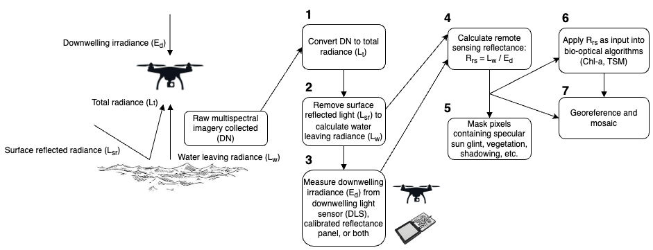
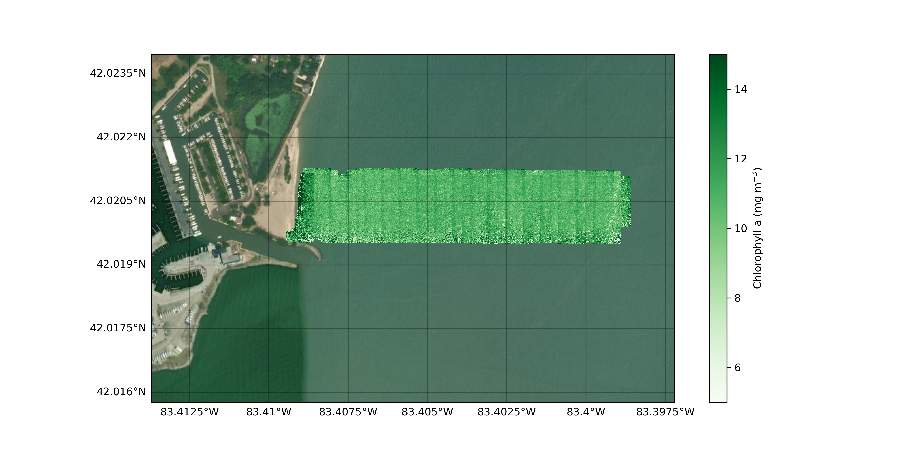

[](https://doi.org/10.5281/zenodo.14018788)

# DroneWQ: A Python library for measuring water quality with a multispectral drone sensor


DroneWQ is a Python package that can be used to analyze multispectral data collected from a drone to derive ocean color radiometry and estimate water quality concentrations. These scripts are specific for the MicaSense RedEdge and Altum cameras. Please note that since this code was originally developed, changes to proprietary sensor branding have occurred. In 2021, MicaSense was acquired by AgEagle Aerial Systems, which subsequently rebranded as EagleNXT in 2025. The [MicaSense sensor product line](https://eaglenxt.com/solutions/micasense-series-multispectral-cameras/) remains available and is expected to remain compatible with DroneWQ.




For details on the processing and theory of DroneWQ, please visit our readthedocs: https://dronewq.readthedocs.io/

Additional information on the methods can be found in:

Román, A., Heredia, S., Windle, A. E., Tovar-Sánchez, A., & Navarro, G., 2024. Enhancing Georeferencing and Mosaicking Techniques over Water Surfaces with High-Resolution Unmanned Aerial Vehicle (UAV) Imagery. Remote Sensing, 16(2), 290. https://doi.org/10.3390/rs16020290

Gray, P.C., Windle, A.E., Dale, J., Savelyev, I.B., Johnson, Z.I., Silsbe, G.M., Larsen, G.D. and Johnston, D.W., 2022. Robust ocean color from drones: Viewing geometry, sky reflection removal, uncertainty analysis, and a survey of the Gulf Stream front. Limnology and Oceanography: Methods. https://doi.org/10.1002/lom3.10511

Windle, A.E. and Silsbe, G.M., 2021. Evaluation of unoccupied aircraft system (UAS) remote sensing reflectance retrievals for water quality monitoring in coastal waters. Frontiers in Environmental Science, p.182. https://doi.org/10.3389/fenvs.2021.674247


## Installation

> [!IMPORTANT]
> Our code requires system level dependencies `gdal`, `zbar`, `exiftool`, and `opencv`.
> It is the most straightforward to install them through conda-forge.

### Install from PyPI (Recommended)

The easiest way to install DroneWQ is using conda and pip:

First, create your conda environment:
```bash
conda create -n {your project name} python=3.13 exiftool gdal zbar opencv -c conda-forge
```

Then, activate your environemt:

```bash
conda activate {your project name}
```

Finally, install dronewq:
```bash
pip install dronewq
```

### Install from environment.yml

1. Clone the repository or download the [environment.yml](./environment.yml) file.
2. Create a conda environment using the environment.yml file:
```bash
conda env create -f environment.yml
```

3. Activate the environment:
```bash
conda activate dronewq
```

### Install from Source

If you want to install from source:

```bash
git clone https://github.com/aewindle110/DroneWQ.git
cd DroneWQ
conda create -n {your project name} python=3.13 exiftool gdal zbar opencv -c conda-forge
conda activate {your project name}
pip install .
```

### System Requirements

DroneWQ requires Python >=3.10. Some dependencies require additional system libraries which is installed through conda:

- **GDAL**: Required for geospatial operations
- **ExifTool**: Required for reading MicaSense image metadata
- **ZBar**: Required for QR code reading from calibration panels


On Ubuntu/Debian:
```bash
sudo apt-get update
sudo apt-get install gdal-bin libgdal-dev exiftool opencv zbar-tools python3-gdal python3-cartopy
```

> [!IMPORTANT]
> Pip on macOS currently doesn't search through the place homebrew installations go to.
> Thus, you have to specify it using this method https://github.com/npinchot/zbar/issues/3#issuecomment-1038005495

On macOS (using Homebrew):
```bash
brew install gdal exiftool zbar opencv
```

**Note**: We have included a modified version of the MicaSense imageprocessing scripts in this repo. Our modifications include:
- Radiance data type expressed as Float32 instead of Uint16
- Image radiance output in milliwatts (mW) instead of watts (W)
- Modified `capture.save_capture_as_stack()` to not scale and filter data

These modifications impact the `panel_ed` calculation. If MicaSense releases a package with user-specified radiance data types, we will revert to their official package. 


## Quick Start

### 1. Organize Your Data

DroneWQ requires MicaSense images organized in a specific folder structure:

```
<main_directory>/
    ├── panel/              # Calibrated reflectance panel images (before/after flight)
    ├── raw_sky_imgs/       # Sky images (40° from zenith, ~135° azimuth)
    ├── raw_water_imgs/     # Water images from flight
    └── align_img/          # One image capture (5 .tif files) for alignment
```

**Directory descriptions:**
- **panel**: Contains image captures of the MicaSense calibrated reflectance panel
- **raw_sky_imgs**: Contains sky images taken at 40° from zenith and ~135° azimuthal viewing direction
- **raw_water_imgs**: Contains all water images captured during the flight
- **align_img**: Contains one image capture (5 .tif files, one per band) from `raw_water_imgs` used to compute the warp matrix for aligning all images

A sample drone dataset consisting of images collected over western Lake Erie is available on [Zenodo](https://doi.org/10.5281/zenodo.14018788) and is 5.84 GB unzipped. Depending on your computer's speed, you may want to subset the data before running the full workflow. 

### 2. Configure Settings

Before processing, configure the main directory path:

```python
import dronewq

# Configure the main directory containing your organized images
dronewq.configure(main_dir="/path/to/your/main_directory")
```

The `configure()` function automatically sets up all subdirectory paths based on the main directory.

### 3. Process Raw Imagery to Remote Sensing Reflectance

The main processing function converts raw imagery to calibrated remote sensing reflectance:

```python
from dronewq import Hedley, DlsEd, ThresholdMasking
# Process raw images to Rrs
dronewq.RrSPipeline(
    output_folder=output_folder,
    lw_method=Hedley(save_images=True),
    ed_method=DlsEd(output_folder),
    masking_method=ThresholdMasking(nir_threshold=0.02),
    workers=4,
    )
```

**Processing workflow:**
1. **Raw → Lt**: Converts raw pixel values to radiance (Lt)
2. **Lt → Lw**: Removes sky reflection to obtain water-leaving radiance (Lw)
3. **Lw → Rrs**: Normalizes by downwelling irradiance (Ed) to obtain remote sensing reflectance (Rrs)
4. **Masking**: Optionally masks pixels containing glint, shadows, or vegetation

### 4. Calculate Water Quality Parameters

Apply bio-optical algorithms to estimate water quality parameters:

```python
# Calculate chlorophyll-a using Gitelson algorithm
dronewq.save_wq_imgs(
    wq_alg=["chl_gitelson"],  # Options: chl_gitelson, chl_hu, chl_ocx, chl_hu_ocx, nechad_tsm
    num_workers=4
)
```

### 5. Georeference and Mosaic

Georeference individual images and create an orthomosaic:

```python
# Load metadata
import pandas as pd
metadata = pd.read_csv("/path/to/metadata.csv")

# Compute flight lines
flight_lines = dronewq.compute_flight_lines(
    captures_yaw=metadata['Yaw'].values,
    altitude=metadata['Altitude'].values[0],
    pitch=0,
    roll=0
)

# Georeference images
dronewq.georeference(
    metadata=metadata,
    input_dir=dronewq.settings.rrs_dir,
    output_dir="/path/to/georeferenced/",
    lines=flight_lines
)

# Create mosaic
dronewq.mosaic(
    input_dir="/path/to/georeferenced/",
    output_path="/path/to/mosaic.tif"
)
```

## Detailed Documentation 

For detailed documentation on the processing theory and methods, please visit: https://dronewq.readthedocs.io/

## Example Workflow

See the `primary_demo.ipynb` notebook for a complete example workflow using the Lake Erie dataset. The notebook demonstrates:

1. Setting up the workspace
2. Extracting and viewing metadata
3. Processing raw imagery to Rrs
4. Applying bio-optical algorithms
5. Georeferencing and creating mosaics

## Performance Tips

1. **Parallel Processing**: Adjust `num_workers` based on your CPU cores (default: 4)
2. **Batch Processing**: Use `start` and `count` parameters to process large datasets in batches
3. **save_images=False**: Turn off intermediate image saving to save disk space and speed up processing

---



Example orthomosaic of UAS images collected over Western Lake Erie, processed to chlorophyll a concentration using DroneWQ.

## Contributions

Contributions are welcome, and they are greatly appreciated! Every little bit helps, and credit will always be given.

Report bugs, request features, or submit feedback as a GitHub Issue.
Make fixes, add content or improvements using GitHub Pull Requests.

