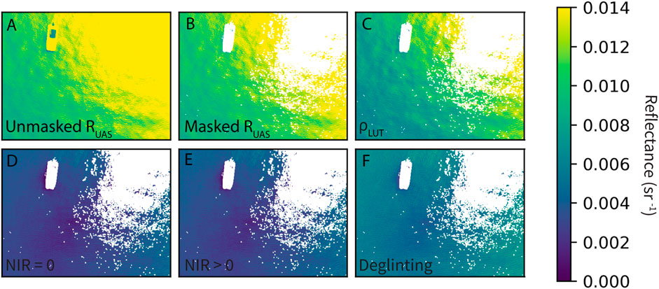
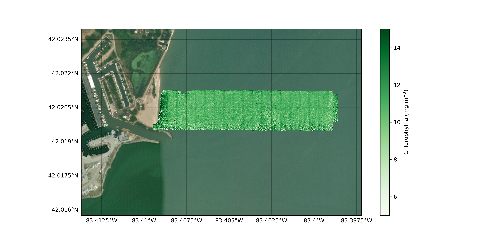

# Summary

Small aerial drones, or unoccupied aerial systems (UAS), conveniently achieve scales of observation between satellite resolutions and in situ sampling, effectively diminishing the “blind spot” between these established measurement techniques [@gray_larsen_johnston_2022]. UAS equipped with off-the-shelf multispectral sensors originally designed for terrestrial applications are being increasingly used to derive water quality properties. Multispectral UAS imagery requires post processing to radiometrically calibrate raw pixel values to useful radiometric units such as reflectance. In aquatic applications, there are additional steps to remove surface reflected light and sun glint, and different approaches to estimate water quality parameters. Georeferencing and mapping UAS imagery over water also comes with challenges since typical structure from motion photogrammetry techniques fail due to lack of feature matching. `DroneWQ` can **1)** convert raw multispectral imagery to total radiance ($L_t$) with units of $W\,m^{-2}\,nm^{-1}\,sr^{-1}$, **2)** remove surface reflected light ($L_{sr}$) to calculate water leaving radiance ($L_w$), **3)** measure downwelling irradiance ($E_d$) from either the calibrated reflectance panel, downwelling light sensor (DLS), or a combination of the two, **4)** calculate remote sensing reflectance ($R_{rs}$) by dividing $L_w$ by $E_d$, and **5)** mask pixels containing specular sun glint or instances of vegetation, shadowing, etc., **6)** use $R_{rs}$ as input into various bio-optical algorithms to derive chlorophyll a and total suspended sediment concentrations, and **7)** georeference using image metadata and sensor specifications to orient and map to a known coordinate system. 

# Statement of need

`DroneWQ` is a Python package for multispectral UAS imagery processing to obtain $R_{rs}$, the fundamental input into ocean color algorithms which can be used to estimate and map water quality parameters. The processing steps, calibrations, and corrections necessary to obtain research quality $R_{rs}$ data from UAS can be prohibitively difficult for those who do not specialize in optics and remote sensing, yet this data can reveal entirely new insight into aquatic ecosystems. `DroneWQ` was designed to be a simple pipeline for those who wish to utilize UAS multispectral remote sensing to analyze ocean color and water quality. The simple functionality of `DroneWQ` will enable effective water quality monitoring at fine spatial resolutions, leading to exciting scientific exploration of UAS remote sensing by students, scientists, and water quality managers. 

# State of the field

Commercial software packages are available for UAS post-processing, georeferencing, and orthomosaic generation (e.g., Pix4D, Agisoft Metashape); however, these tools are primarily designed for terrestrial imagery and often perform poorly over water because the water surface lacks stable features required for robust image matching. Several open-source tools also support general UAS image processing. For example, the MicaSense company (now EagleNXT) developed an open-source codebase for processing imagery acquired with MicaSense RedEdge and Altum imagery (https://github.com/micasense/imageprocessing) which is well suited for basic terrestrial remote sensing applications. 

Despite the availability of these commercial and open-source tools, there are currently no community-developed software packages specifically designed for processing drone-based imagery for aquatic remote sensing and water quality applications. `DroneWQ` builds upon existing UAS processing workflows to enable the calculation of aquatic remote sensing reflectance and derived water quality parameters. To our knowledge, `DroneWQ` is the first open-source software package that provides an end-to-end workflow for processing raw multispectral UAS imagery into aquatic remote sensing reflectances and water quality products relevant to environmental research and management.

# Software design
`DroneWQ` is a modular, object oriented Python package that implements a processing pipeline for transforming raw multispectral UAS imagery into georeferenced remote sensing reflectance and derived water quality products. The software follows a workflow-oriented design in which individual processing steps (data ingestion, radiometric calibration, reflectance retrieval, quality control, bio-optical inversion, georeferencing, and mosaicking) are implemented in reusable classes. This architecture promotes transparency, flexibility, and ease of extension, allowing users to modify or replace individual components without altering the overall pipeline.
A key design feature of `DroneWQ` is the ability to project and georeference imagery, which leverages onboard GPS and orientation metadata to map imagery without relying on conventional structure-from-motion approaches that often fail over water due to limited spatial feature contrast. The package integrates radiometric corrections, glint correction methods, and established ocean color algorithms to produce remote sensing reflectance and water quality products within a unified framework. Configuration is handled through a centralized setup function that manages file paths and processing parameters, supporting reproducible workflows. The software has fairly minimal dependencies and can be integrated into a wide range of development workflows. Here it is demonstrated within a Jupyter notebook, enabling interactive analysis while maintaining reproducibility for batch processing.

# Background/Theory

UAS can measure remote sensing reflectance ($R_{rs}$) defined as:

$$
R_{rs}(\theta, \phi, \lambda) =
\frac{L_W(\theta, \phi, \lambda)}
{E_d(\theta, \phi, \lambda)}
$$

where $L_W$ ($W\,m^{-2}\,nm^{-1}\,sr^{-1}$) is water-leaving radiance, $E_d$ ($W\,m^{-2}\,nm^{-1}$) is downwelling irradiance, θ represents the sensor viewing angle between the sun and the vertical (zenith), φ represents the angular direction relative to the sun (azimuth) and λ represents wavelength. 

UAS do not measure $R_{rs}$ directly as the at-sensor total radiance ($L_T$, $W\,m^{-2}\,nm^{-1}\,sr^{-1}$) constitutes the sum of $L_W$ and incident radiance reflected off the sea surface into the detector's field of view, referred to as surface reflected radiance ($L_{SR}$). $L_W$ is the radiance that emanates from the water and contains a spectral shape and magnitude governed by optically active water constituents, while $L_{SR}$ is independent of water constituents and instead governed by the water surface reflecting the downwelling light; a familiar example is sun glint. Here we define UAS total reflectance ($R_{UAS}$) as:

$$
R_{UAS}(\theta, \phi, \lambda) = \frac{L_T(\theta, \phi, \lambda)}{E_d(\lambda)}
$$

where:

$$
L_T(\theta, \phi, \lambda) = L_W(\theta, \phi, \lambda) + L_{SR}(\theta, \phi, \lambda)
$$

Due to the differing orientation of wave facets reflecting radiance from different parts of the sky, $L_{SR}$ can vary widely within a single UAS image. `DroneWQ` provides multiple options from the literature for removing $L_{SR}$.

 
Figure 1. Example of an individual UAS image (green band) at different processing steps and methods: (A) $R_{UAS}$, (B) $R_{UAS}$ with initial sun glint masking and (C–F) remote sensing reflectance ($R_{rs}$) using various methods to remove surface reflected light: (C) ⍴ look-up table (LUT) from HydroLight simulations, (D) Dark pixel assumption with NIR = 0, (E) Dark pixel assumption with NIR > 0, (F) Deglingting methods following [@hedley_harborne_mumby_2005]. Figure taken from [@windle_silsbe_2021].

A secondary challenge in aquatic UAS remote sensing is the georeferencing and mosaicking of imagery. Conventional photogrammetry techniques, such as Structure-from-Motion (SfM), rely on identifying common key points between overlapping images. Over large bodies of water, however, the relatively homogeneous surface and dynamic wave patterns provide few stable features for image matching, often resulting in poor image alignment or failed reconstructions. Rather than relying on feature-based image matching, `DroneWQ` uses the sensor pose information recorded during image acquisition (i.e., the position and orientation of the sensor) to project each image into geographic space and generate georeferenced mosaics. The resulting mosaics provide a spatially consistent foundation for retrieving aquatic remote-sensing reflectance and subsequent water quality products. The accuracy of the resulting georeferenced and mosaicked imagery depends on factors including GPS quality, flight altitude, image overlap, and environmental conditions.  

 
Figure 2. Final orthomosaic of UAS images collected over Western Lake Erie processed to chlorophyll a concentration.

# Research impact statement

`DroneWQ` has demonstrated growing research impact and community engagement since its initial development. The project has expanded beyond its original authors (\@aewindle110; \@patrickcgray) to include contributions from four additional developers, reflecting increasing adoption and collaborative development. Community involvement has supported the evolution of the software through feature requests, bug reports, and user feedback submitted via GitHub Issues and direct communication, indicating active use by a broader research community.
`DroneWQ` has been used in multiple peer-reviewed studies focused on UAS aquatic remote sensing and water quality retrievals [@roman_heredia_windle_tovar_sanchez_navarro_2024; @gray_windle_dale_savelyev_johnson_silsbe_larsen_johnston_2022; @windle_silsbe_2021]. These applications demonstrate the utility of the software for advancing research using multispectral UAS imagery in aquatic environments, particularly where traditional processing approaches are limited. As interest in UAS-based water quality monitoring continues to grow, `DroneWQ` provides an open, extensible framework that supports both scientific investigation and applied environmental monitoring.

# AI usage disclosure

The creation of this software was mostly done by humans. AI assisted in identifying and diagnosing bugs, as well as generating docstrings, both of which were thoroughly reviewed by humans.

# Acknowledgements

We acknowledge and appreciate helpful support from the Micasense team. We thank Julian Dale for assisting with UAS flights. 

# References

